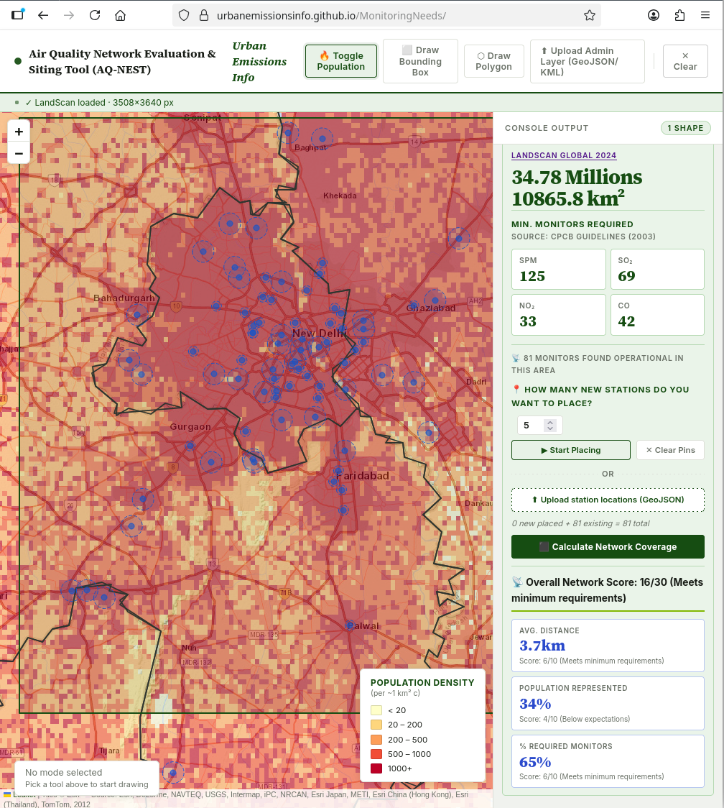
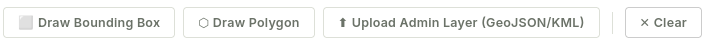
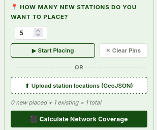

# AQ-NEST (Air Quality Network Evaluation & Siting Tool)

AQ-NEST is a web tool designed to estimate how many air quality monitors a region needs based on human population, and to evaluate how well existing or proposed monitor networks cover those people.
You can access this tool here:
1. [India specific tool](https://urbanemissionsinfo.github.io/AQNEST/) - has pre-loaded CPCB monitors locations.
2. [Global](https://urbanemissionsinfo.github.io/AQNEST/global.html)



## Objective

The core goal of AQ-NEST is to turn **spatial population distribution** into actionable monitoring requirements.

By overlaying global population datasets with local administrative boundaries or custom-drawn areas, the tool calculates:
1. Total population within a targeted spatial region.
2. Minimum required air quality monitoring stations based on regulatory guidelines.
3. A Network Score evaluating how well a network of stations represents the air breathed by the local population.

## How to use this tool?

1. The tool pre-loads 2024's Landscan Global population raster. You can use the `Toggle Population` button to see/unsee the population heatmap. On a slower internet connection, it might take a few seconds for the browser to load it. 
2. **Define an area of interest:** There are three ways to do it:

    - Draw a bounding box
    - Draw a polygon
    - Upload an admin layer in GeoJSON or KML format
3. The tool calculates the area defined and population living in it. The tool uses regulatory guidelines (CPCB 2003) to calcualte the minimum number of monitors required using the population data.
4. **Place a monitor network:** There are two ways to place your air quality monitoring network. 
    - You can choose number of monitors you'd want in your network and place them after clicking `Start Placing` button. You can manually click on the map to place a monitor at that location. Note that you can only place monitors inside the area defined.
    - You can upload a GeoJSON (points layer) of stations. All the stations that fall inside the area defined will be placed on the map.
5. **Click on  `Calculate Network Coverage` button:** It presents three metrics along with the overall network score.
    - Average distance between the stations in the network.
    - Population represented by the network placed.
    - Percentage of minimum required monitors.
6. You can also manually move the stations on the map after placing them and recalculate the network coverage.
7. Finally, you can download your network as a GeoJSON. You can upload this GeoJSON in `Step4` 

## Methodology
The web app runs entirely in the browser using raster processing and spatial analysis.

```text
┌──────────────────────────────────────────────┐
│ Spatial Area Selection                       │
│ • Draw Bounding Box / Polygon  (OR)          │
│ • Upload GeoJSON or KML of Admin Layer       │
└──────────────────────────────────────────────┘
                      │
                      ▼
┌──────────────────────────────────────────────┐
│ LandScan 2024 Population                     │
│ • Intersect selected region with raster      │
│ • Calculate population in the region         │
└──────────────────────────────────────────────┘
                      │
                      ▼
┌──────────────────────────────────────────────┐
│ Urban Correction Factor                      │
│ • Calculate density ratio                    │
│ • High-Density Cells / Urban Cells           │
└──────────────────────────────────────────────┘
                      │
                      ▼
┌──────────────────────────────────────────────┐
│ CPCB Monitor Requirement                     │
│ • Compute required monitors                  │
│ • SPM/PM, SO₂, NO₂, and CO                   │
└──────────────────────────────────────────────┘
                      │
                      ▼
┌──────────────────────────────────────────────┐
│ Station Placement & Score                    │
│ • Place or upload monitor locations          │
│ • Evaluate coverage and distance             │
│ • Calculate Network Score                    │
└──────────────────────────────────────────────┘
```

### Population

Population datasets are taken from [Landscan Global 2024](https://landscan.ornl.gov/). This data is in raster format with spatial resolution of 30 arc seconds (1km at equator). Each pixel has the data on number of people living in that cell.

When an area is defined, the tool extracts all underlying raster pixels and sums the total population.

### Urban Correction Factor (UCF)

Not all population density is evenly distributed. To prevent under-estimating monitor needs in heavily clustered urban centers:

1. The tool calculates average population density across non-zero cells in the selected shape.
2. It identifies high-density cells (population > average density) and urban core cells (population > 500 per cell).
3. The Urban Correction Factor (UCF) is computed as:$$\text{UCF} = 1 + \left( \frac{\text{High Density Cells}}{\text{Urban Cells (> 500)}} \right)$$

## Regulatory Minimum Monitor Estimation
Using CPCB (Central Pollution Control Board) guideline formulas, the tool estimates minimum required monitoring stations across pollutants:
1. PM / Suspended Particulate Matter (SPM) - scaled by UCF.
2. Sulfur Dioxide ($\text{SO}_2$)
3. Nitrogen Dioxide ($\text{NO}_2$)
4. Carbon Monoxide ($\text{CO}$)

Background monitoring station counts (5% of SPM monitors) are also automatically calculated as a baseline offset.

## Network Coverage Scores

AQ-NEST evaluates the network using three metrics:
1. **Population Coverage Score (10 pts):** Measures the percentage of the target population living within the effective radius of a monitor ($1\text{ km}$ for high-density areas $>8,000\text{ pop/cell}$, $2\text{ km}$ elsewhere).
2. **Average Nearest-Neighbor Distance Score (10 pts):** Evaluates spatial clustering and inter-station spacing.
3. **Requirement Met Score (10 pts):** Compares the number of placed monitors against CPCB's minimum target.

Overall Network Score is the sum of these three metrics to a maximum of 30.

## Supported Regions

AQ-NEST includes pre-compressed LandScan datasets covering multiple global regions:

1. South Asia
2. South East Asia
3. Central Asia
4. Africa
5. South America
6. Central America

## Tech Stack

1. **Frontend**: Vanilla HTML5, CSS3 (Custom design system).
2. **Mapping**: Leaflet.js (Tiles & Vector layers).
3. **Spatial Processing**: GeoTIFF.js (Browser-side raster parsing), toGeoJSON (KML parsing), D3.js.

--- 
Please refer to our course tutorial [How many monitors are needed in an airshed?](https://urbanemissionsinfo.github.io/AQCourse/notebooks/How_many_monitors_needed.html) for more details.

This tool is built with the help of `Claude Sonnet 4.6` and `Gemini 3.1 Pro`